# Accessing Private Code Repository in IBM Cloud Code Engine

This article details the process of deploying an application in the IBM Cloud Code Engine by using the source code accessible within a Private Github repository.

## 1. Create SSH Key

1. Run the below command in the terminal with your email id.

  ```
    ssh-keygen -t ed25519 -C "jxxxxxx@xxxx.com"
  ```
2. It will ask for the file to save the key like this. You need to enter some file ex: `test`


3. It will ask for passphrase and confirm passphrase. You can just press Enter for both.

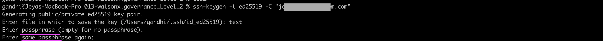

The output should be like this.

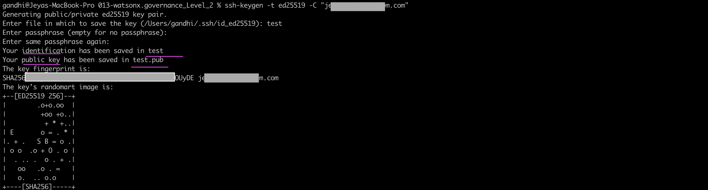


4. Run the below command to get the public key
  ```
    cat test.pub
  ```


5. Run the below command to get the private key
  ```
    cat test
  ```
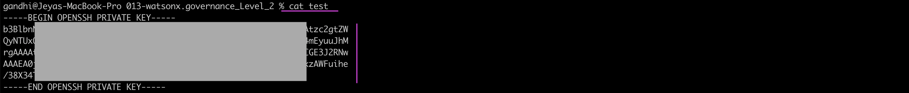


## 2. Add SSH Key to Github repo.

Let us deploy public key in github account.

1. Goto your github repo.

2. Goto to Deploy Keys page by navigating to `Settings > Deploy keys`

3. Click on `Add deploy key` button

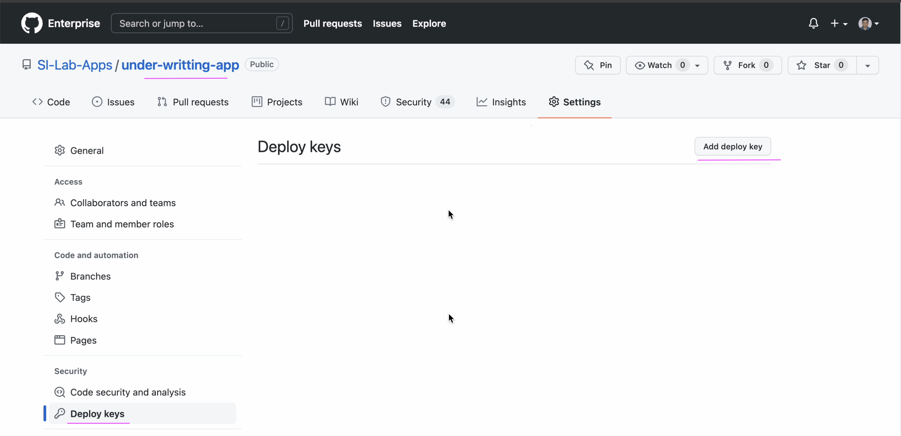


4. Enter `Title` and `Key` 

5. Click on `Add Key`
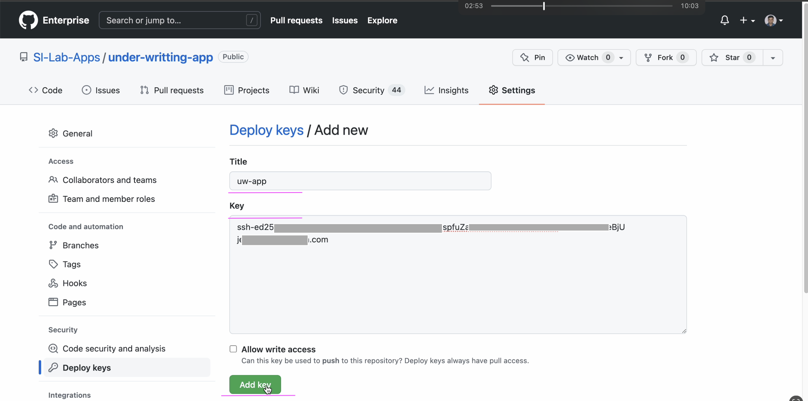

Note: The `SSH Public Key` is from previous section.


The public key is deployed in github account successfully.

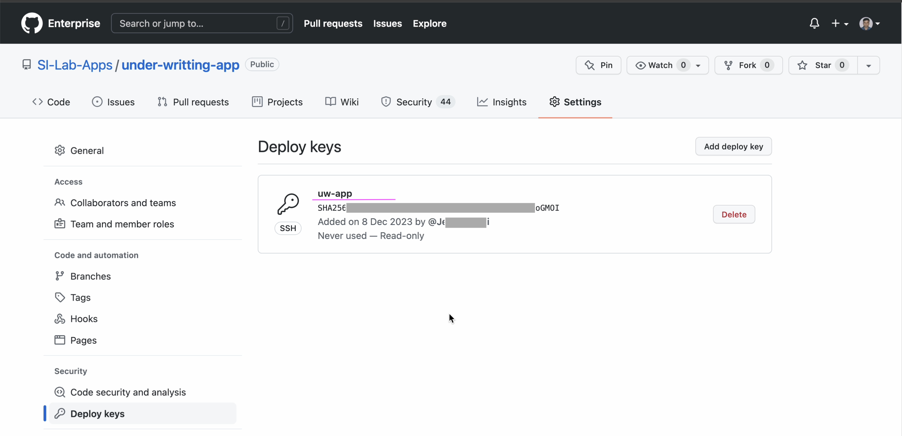

## 2. Private Code Repo Access

Let use create a Private GitHub repo access in Code Engine.

1. Open an  project by clicking on `Code Engine > Projects > XXXX Project`

2. Click on `Create`
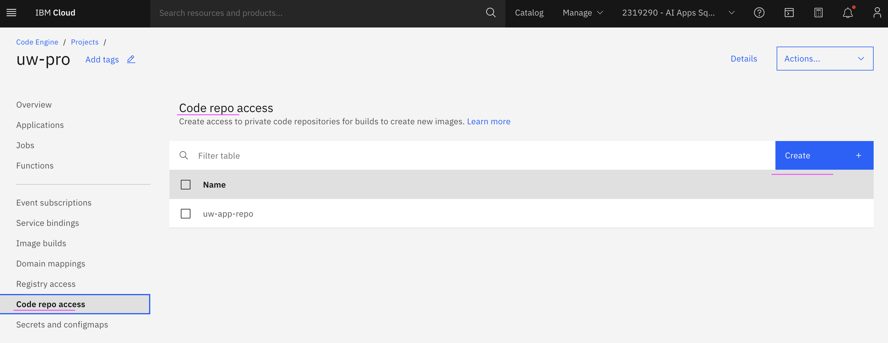

3. Enter `Name` and `SSH Private Key` 

4. Click on `Create`
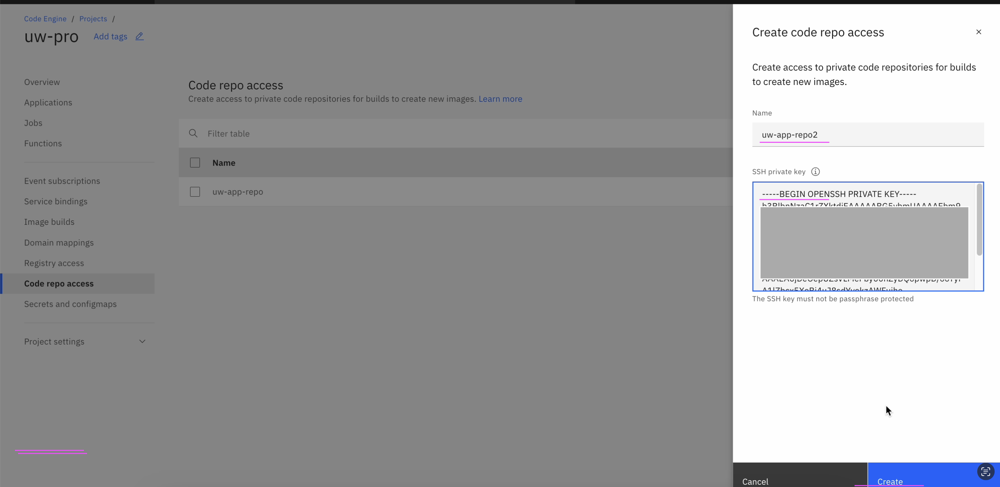

Note: The `SSH Private Key` is from previous section.


Code Repo access got created.

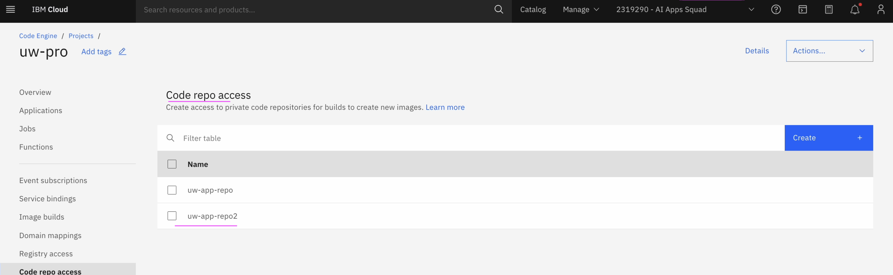

## 3. Create application using source code from Private Code Repo

Let use create an Application using the src code available in the private code repo (github.ibm.com) 

1. Open an  project by clicking on `Code Engine > Projects > XXXX Project`

2. Click on `Applications menu`

3. Click on `Create`
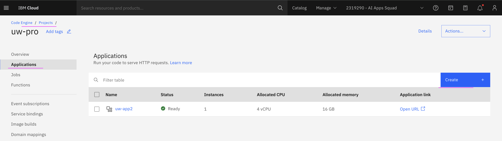

3. Enter the name for of the application.

4. Choose `Source Code` Option.

5. Click on `Specify build details` button.

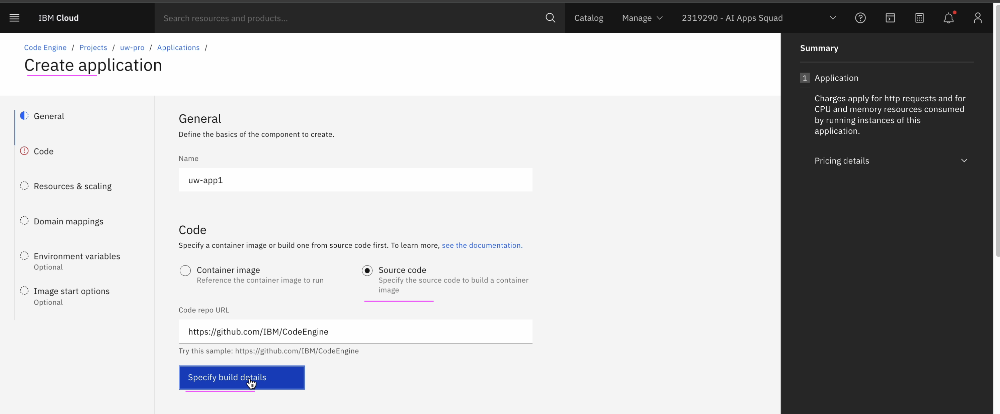

6. Copy the ssh url of the code repo

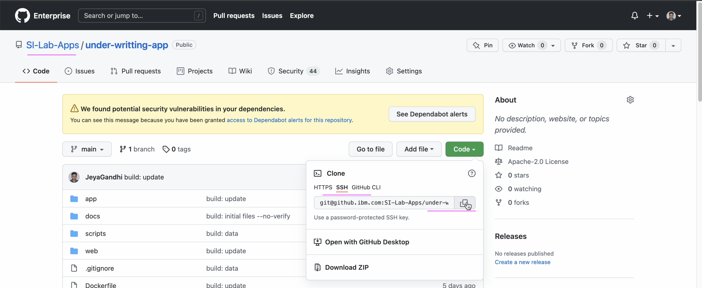

7. Paste the ssh url in the `Code repo URL` field.

8. Choose the `Code repo access` value in the field.

9. Enter Branch Name.

10. Click on `Next` button

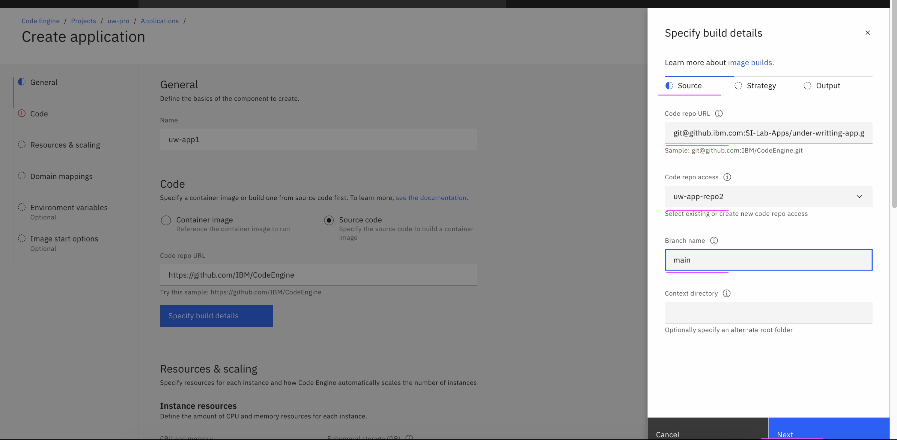

11. Choose a strategy as `Dockerfile`. Hope you have Dockerfile in your code repo.

11. Click on `Next` button

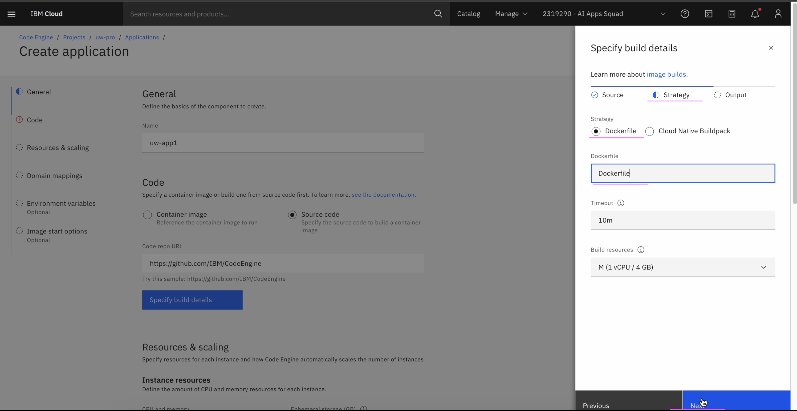

12. Click on `Done` button.


### Reference

Accessing private code repositories
https://cloud.ibm.com/docs/codeengine?topic=codeengine-code-repositories