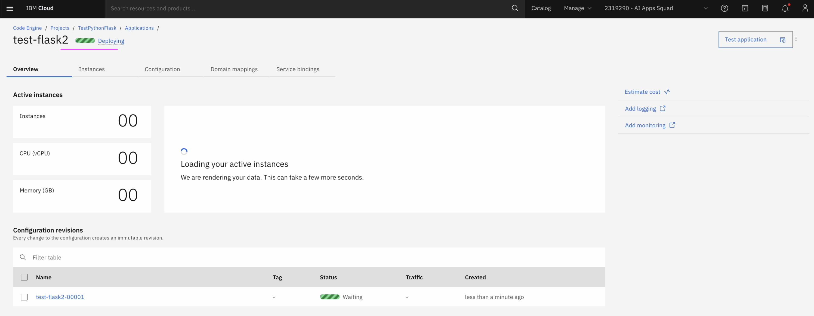

# Deploying Application in IBM Cloud Code Engine

This article contains the step by step instruction about deploying an application in IBM Cloud Code Engine.

- The Application source code is available in Public GitHub repository
- Container image of the application is going to build by the Code Engine and pushed to the IBM Cloud Container Registry

## 1. Create Project

Need to create a project to deploy any application on it. 

1. Open the Project screen by clicking  `CodeEngine > Projects`

2. Click on `Create`

3. Choose the `location`

4. Enter the `Project Name`

5. Click on `Create`

Project is created.

## 2. Container Registry Acccess

Prepare IBM Cloud Container Registry.

### 2.1. Create namespace in Container Registry

Need to have namespace in the Container Registry to store the images.

1. Choose the required `Location`
2. Create an `namespace` in the IBM Cloud Container Registry, if it doesn't exists.

### 2.2. Create IBM Cloud API Key

To push/pull the images in Container Registry, access rights are required. Need to create API key in IAM.

1. Open the API Keys screen from `Manage > IAM > API Keys `
2. Create an API Key

### 2.3. Create Registry Access in Code Engine

Need to create registry access to push/pull container image. 

1. Open the Registry access secrets screen by clicking  `CodeEngine > Projects > Project Name : TestPythonFlask > Registry access `

2. Click on `Create`

3. Enter the below details.

- Registry Source : Custom
- Registry Name : Give any name
- Registry Server : us.icr.io   (remember we created `gan-ns-dallas` namespace in `Dallas`)
- UserName : iamapikey
- Password : API Key (we created in the previous step)

4. Click on `Create`

Registry access is created.

## 3. Create Application

Create an application in the Project.

1. Open the Application screen by clicking  `CodeEngine > Projects > Project Name : TestPythonFlask > Application `

2. Click on `Create`

3. Enter the following

- Application Name : Give any name here (test-flask2)
- Choose  `Source code ` option
- Source Code URL - Give the github url of your source code. You can give this url https://github.com/GandhiCloudLab/ibm-code-engine-deploy-app as well. It has hello-world python program.

4. Click on `Specify build details`

5. Enter `Branch Name`
6. Click on `Next`

7. Choose `Strategy` as `Cloud Native Build Pack`
8. Click on `Next`

9. Enter the following

- Registry Server : us.icr.io
- Registry access secret : Give the registry secrete that has already been created in the previous step.
- Namespace : Give the namespace that has already been created in the container registry.

10. Click on `Done`

Application is getting deployed

Application is created

Container registry contains the images

## 4. Accessing the application

1. Click on `Open URL` from the application

Application is open and it shows the home page.

